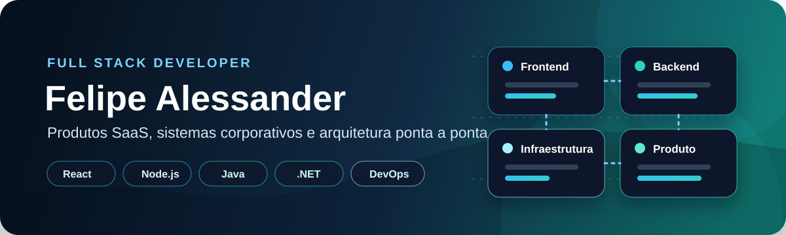
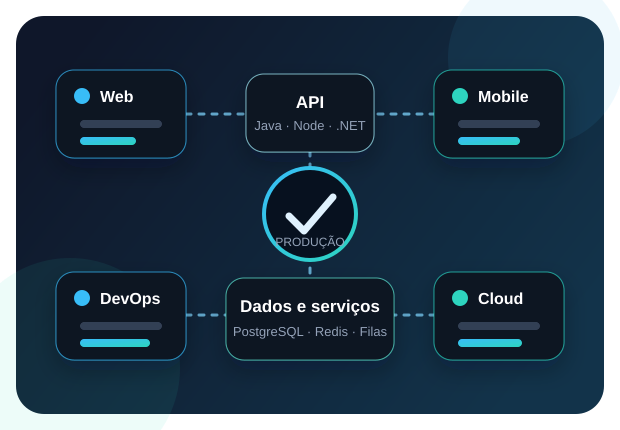

<div align="center">
  
</div>

<div align="center">
  <a href="https://www.linkedin.com/in/felipe-alessander-dev/">
    
  </a>
  <a href="mailto:felipe.luiz@waxp.com.br">
    
  </a>
  <a href="https://waxp.com.br">
    
  </a>
  <a href="https://github.com/Feeh03114?tab=repositories">
    
  </a>
  
</div>

<br>

<table>
  <tr>
    <td width="58%" valign="top">
      <h2>👨‍💻 Sobre mim</h2>
      <p>Sou <strong>Desenvolvedor Full Stack</strong> e <strong>Engenheiro da Computação</strong>, com experiência na criação de produtos digitais completos — da ideia e modelagem até o deploy e a operação em produção.</p>
      <p>Atuo com <strong>frontend, backend, arquitetura e infraestrutura</strong>, desenvolvendo plataformas SaaS, sistemas corporativos, aplicativos, APIs e integrações voltadas a problemas reais de negócio.</p>
      <p>Trabalho principalmente com <strong>React, React Native, Angular, Node.js, Java, Spring Boot e .NET</strong>, mantendo uma visão de produto e responsabilidade de ponta a ponta.</p>
    </td>
    <td width="42%" align="center">
      
    </td>
  </tr>
</table>

## ⚡ O que eu construo

<table>
  <tr>
    <td width="25%" align="center"><strong>🚀 Produtos SaaS</strong><br><sub>Ideia · Arquitetura · Produção</sub></td>
    <td width="25%" align="center"><strong>🏪 ERP e PDV</strong><br><sub>Vendas · Estoque · Fiscal</sub></td>
    <td width="25%" align="center"><strong>🔗 Integrações</strong><br><sub>APIs · Webhooks · Tempo real</sub></td>
    <td width="25%" align="center"><strong>☁️ Infraestrutura</strong><br><sub>Docker · CI/CD · Cloud</sub></td>
  </tr>
</table>

## 🧰 Tecnologias e ferramentas

<div align="center">
  <p><strong>Frontend e aplicações</strong></p>
  

  <br><br>

  <p><strong>Backend e dados</strong></p>
  

  <br><br>

  <p><strong>Infraestrutura e entrega</strong></p>
  

  <br><br>

  
  
  
  
  
</div>

## 🚀 Produtos em destaque

<table>
  <tr>
    <td width="33%" valign="top">
      <h3 align="center">UniCore</h3>
      <p align="center"><strong>ERP, PDV e operação para restaurantes e varejo</strong></p>
      <p>Ecossistema com vendas, estoque, fiscal, cozinha, autoatendimento, cardápios, dispositivos e gestão operacional.</p>
      <p align="center"><a href="https://unicore.waxp.com.br"><strong>Conhecer o produto →</strong></a></p>
    </td>
    <td width="33%" valign="top">
      <h3 align="center">ImobXP</h3>
      <p align="center"><strong>Plataforma SaaS para imobiliárias</strong></p>
      <p>Solução voltada à gestão de imóveis, operação comercial, presença digital e organização dos processos imobiliários.</p>
      <p align="center"><a href="https://imobxp.com.br"><strong>Conhecer o produto →</strong></a></p>
    </td>
    <td width="33%" valign="top">
      <h3 align="center">AtendXP</h3>
      <p align="center"><strong>Atendimento omnichannel e integrações</strong></p>
      <p>Plataforma baseada no Chatwoot, personalizada para atendimento multicanal, automações e integrações empresariais.</p>
      <p align="center"><a href="https://atendxp.waxp.com.br"><strong>Conhecer o produto →</strong></a></p>
    </td>
  </tr>
</table>

> Meus principais produtos profissionais estão em repositórios privados. No GitHub público, mantenho estudos, provas de conceito, contribuições e projetos demonstrativos.

## 🧠 Como eu trabalho

<table>
  <tr>
    <td width="25%" align="center"><strong>1. Entendo</strong><br><sub>Problema e regra de negócio</sub></td>
    <td width="25%" align="center"><strong>2. Estruturo</strong><br><sub>Dados, arquitetura e fluxo</sub></td>
    <td width="25%" align="center"><strong>3. Desenvolvo</strong><br><sub>Frontend, backend e integrações</sub></td>
    <td width="25%" align="center"><strong>4. Entrego</strong><br><sub>Deploy, monitoramento e evolução</sub></td>
  </tr>
</table>

## 📊 Minha atividade no GitHub

<div align="center">
  
  
</div>

## 🎯 Em evolução contínua

```text
Arquitetura e sistemas SaaS    ███████████████████░  construindo
Escalabilidade e cloud         █████████████████░░░  evoluindo
IA aplicada ao desenvolvimento ████████████████░░░░  explorando
```

<div align="center">
  <h3>Vamos transformar um problema real em um produto que funciona?</h3>
  <p>
    <a href="https://www.linkedin.com/in/felipe-alessander-dev/">LinkedIn</a>
    ·
    <a href="mailto:felipe.luiz@waxp.com.br">E-mail</a>
    ·
    <a href="https://github.com/Feeh03114?tab=repositories">Repositórios</a>
  </p>
  <sub>Código, produto e infraestrutura trabalhando juntos.</sub>
</div>
